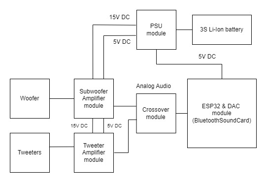

# Bluetooth-speaker
Wireless bluetooth speaker with high quality sound.

## Features
- Custom made sound card with an ESP32 and a high quality 24bit 192khz dac, Hi-Fi quality
- Completely wireless: battery charging and BMS included
- Amplifiers and crossover custom made for this product, design is power efficient
- Can support LDAC bluetooth codec for higher music bitrate (up to 990 kbps)

## Documentation
- Schematics can be found in the hardware folder
- Code is self explanatory, thus no documentation is needed
- PlatformIO: https://platformio.org/
- DAC datasheet: https://statics.cirrus.com/pubs/proDatasheet/CS4344-45-48_F2.pdf
- ESP32 datasheet: https://www.espressif.com/sites/default/files/documentation/esp32-wroom-32e_esp32-wroom-32ue_datasheet_en.pdf
- Bluetooth library used: https://github.com/pschatzmann/ESP32-A2DP

- Oamk documentation in its own folder

## Architecture

  
